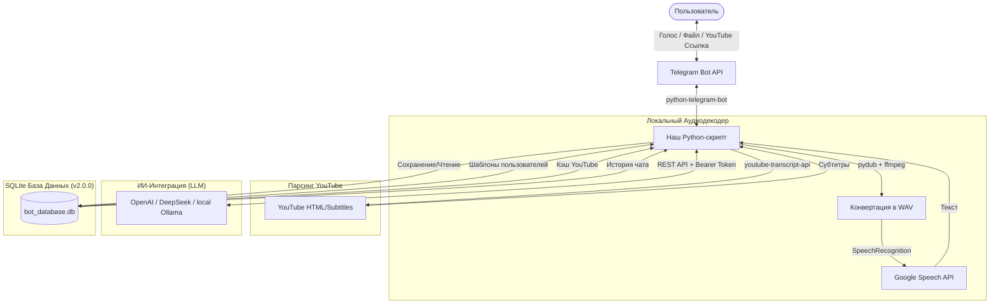

# 🤖 AI Summary YT Voice Agent Bot v2.0.0 (с Базой Данных)

Telegram-бот на Python для полной переработки медиа-информации. Бот принимает **голосовые сообщения с микрофона, аудиофайлы любых форматов (MP3, WAV, OGG, M4A)** и **ссылки на YouTube (включая Shorts)**, автоматически транскрибирует их в текст, а затем предлагает переработать информацию по готовым ИИ-шаблонам или обсудить контент в режиме живого чата с LLM.

В новой версии добавлена **SQLite База Данных** для постоянного хранения:
- Кастомных шаблонов пользователей
- Кэша транскриптов YouTube (экономия лимитов и ускорение повторных запросов)
- Истории диалогов (сохранение контекста при перезапуске бота)

---

## 🚀 Основные возможности

* **Мультиформатный импорт аудио**: Обработка не только голосовых заметок Telegram (`.ogg`), но и прикрепленных аудиофайлов (`.mp3`, `.wav`, `.m4a`).
* **Парсинг YouTube и Shorts**: Быстрое извлечение субтитров из обычных видеороликов и ультракоротких Shorts с имитацией сигнатуры реального браузера (User-Agent, Referer).
* **Кэширование YouTube субтитров**: Повторный запрос видео выполняется мгновенно из локальной БД без обращения к внешним API.
* **Кастомные ИИ-шаблоны**: Переработка транскрипта по одному клику:
  * *Краткое саммари* (выделение главного буллетами).
  * *Пирамида Минто* (структурирование от вывода к деталям).
  * *Экшен-план (Action Items)* (создание чек-листа задач).
  * *Аналитический конспект* (подробный разбор инсайтов).
  * **Собственные шаблоны**: Создавайте и редактируйте свои шаблоны через команду `/add_template`.
* **Свободный диалог с ИИ**: Обсуждайте материал с нейросетью прямо в чате, задавая уточняющие вопросы по контексту статьи, видео или записи.
* **Гибкий бэкенд**: Легкое переключение между облачными API (OpenAI, DeepSeek) и локальными моделями через Ollama на вашем IP-адресе.

## 🛠 Архитектурная схема работы

---

📋 Системные требования и зависимости
Для работы аудиоконвертера в вашей операционной системе должна быть установлена утилита FFmpeg:

Ubuntu/Debian: sudo apt update && sudo apt install ffmpeg
macOS: brew install ffmpeg
Windows: Скачайте бинарный файл с официального сайта FFmpeg и добавьте путь к нему в переменные окружения PATH.
⚙️ Установка и запуск
Склонируйте репозиторий:

git clone <https://github.com/your-username/advanced-voice-yt-bot.git>
cd advanced-voice-yt-bot
Установите зависимости:

pip install -r requirements.txt
Задайте переменные окружения и запустите бота:

Для OpenAI:

export TELEGRAM_BOT_TOKEN="ваш_то...ther"
export AI_PROVIDER="openai"
export AI_API_KEY="ваш_ap...enai"
export AI_MODEL="gpt-4o-mini"
export DB_PATH="bot_database.db"  # опционально, по умолчанию "bot_database.db"
python advanced_voice_yt_bot_v2_db.py
Для локальной Ollama:

export TELEGRAM_BOT_TOKEN="ваш_то...ther"
export AI_PROVIDER="ollama"
export AI_API_KEY="any_no...ring"
export AI_API_URL="<http://localhost:11434/v1>"
export AI_MODEL="llama3"
export DB_PATH="bot_database.db"  # опционально, по умолчанию "bot_database.db"
python advanced_voice_yt_bot_v2_db.py
Управление кастомными шаблонами
После запуска бота вы можете создавать свои шаблоны переработки:

/add_template ID | Название | Промпт
Пример:

/add_template 5 | Мой переводчик | Переведи текст на английский язык.
Где:

ID — уникальный идентификатор вашего шаблона (можно использовать числа или строки)
Название — отображаемое имя в меню выбора шаблона
Промпт — инструкция для ИИ, как обрабатывать текст

📄 Лицензия
Этот проект распространяется под лицензией MIT. Подробности см. в файле LICENSE.
