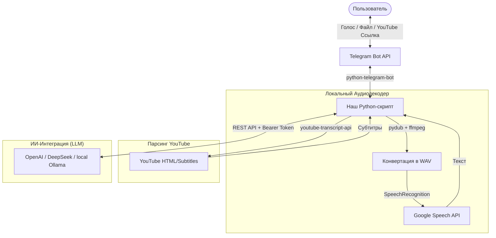

# 🤖 AI Summary YT Voice Agent Bot

Telegram-бот на Python для полной переработки медиа-информации. Бот принимает **голосовые сообщения с микрофона, аудиофайлы любых форматов (MP3, WAV, OGG, M4A)** и **ссылки на YouTube (включая Shorts)**, автоматически транскрибирует их в текст, а затем предлагает переработать информацию по готовым ИИ-шаблонам или обсудить контент в режиме живого чата с LLM.

---

## 🚀 Основные возможности

* **Мультиформатный импорт аудио**: Обработка не только голосовых заметок Telegram (`.ogg`), но и прикрепленных аудиофайлов (`.mp3`, `.wav`, `.m4a`).
* **Парсинг YouTube и Shorts**: Быстрое извлечение субтитров из обычных видеороликов и ультракоротких Shorts с имитацией сигнатуры реального браузера (User-Agent, Referer).
* **Кастомные ИИ-шаблоны**: Переработка транскрипта по одному клику:
  * *Краткое саммари* (выделение главного буллетами).
  * *Пирамида Минто* (структурирование от вывода к деталям).
  * *Экшен-план (Action Items)* (создание чек-листа задач).
  * *Аналитический конспект* (подробный разбор инсайтов).
* **Свободный диалог с ИИ**: Обсуждайте материал с нейросетью прямо в чате, задавая уточняющие вопросы по контексту статьи, видео или записи.
* **Гибкий бэкенд**: Легкое переключение между облачными API (OpenAI, DeepSeek) и локальными моделями через Ollama на вашем IP-адресе.

---

## 🛠 Архитектурная схема работы



---

## 📋 Системные требования и зависимости

Для работы аудиоконвертера в вашей операционной системе должна быть установлена утилита **FFmpeg**:
* **Ubuntu/Debian**: `sudo apt update && sudo apt install ffmpeg`
* **macOS**: `brew install ffmpeg`
* **Windows**: Скачайте бинарный файл с официального сайта FFmpeg и добавьте путь к нему в переменные окружения `PATH`.

---

## ⚙️ Установка и запуск

1. Склонируйте репозиторий:
   ```bash
   git clone https://github.com/your-username/advanced-voice-yt-bot.git
   cd advanced-voice-yt-bot
   ```

2. Установите зависимости:
   ```bash
   pip install -r requirements.txt
   ```

3. Задайте переменные окружения и запустите бота:

   **Для OpenAI:**
   ```bash
   export TELEGRAM_BOT_TOKEN="ваш_токен_от_BotFather"
   export AI_PROVIDER="openai"
   export AI_API_KEY="ваш_api_ключ_openai"
   export AI_MODEL="gpt-4o-mini"
   python advanced_voice_yt_bot.py
   ```

   **Для локальной Ollama:**
   ```bash
   export TELEGRAM_BOT_TOKEN="ваш_токен_от_BotFather"
   export AI_PROVIDER="ollama"
   export AI_API_KEY="any_non_empty_string"
   export AI_API_URL="http://localhost:11434/v1"
   export AI_MODEL="llama3"
   python advanced_voice_yt_bot.py
   ```

---

## 📄 Лицензия

Этот проект распространяется под лицензией MIT. Подробности см. в файле [LICENSE](LICENSE.md).
